# 更优雅的Git使用流程

## 更优雅地提交
前一节的两个命令解决了不规范合并的问题，还有一个问题是如何让提交信息更有价值？
如何定义一个提交信息是否有价值呢？通过经验，我们认为有价值的描述具备以下几点特性:
* 阐述清楚变更的作用（必备）
* 简单描述程序实现思路（推荐）
* 提醒需要特别注意的地方（推荐）
* 包含需求来源（强烈推荐）

首先是变更的目的或者说作用，我们推荐使用以下几个词来表述常见场景的变更:
* ```feat```: ```feature```，特性，提交是为了完成某个需求或功能，强烈建议附加实现方案描述和需求来源链接，通常对应一个开发任务
* ```fix```: 修复，提交是为了修复某个已提测的问题，通常关联一个提测后的BUG单
* ```hotfix```: 热修复，指提交是为了修复某个线上问题，需要快速发布，通常关联一个线上BUG单
* ```refactor```: 重构，提交是进行代码结构或设计的重构，通常需要回归测试
* ```chore```: 杂项，提交完成一些日志、注释、文档编写，或是构建工具等变动，通常不需要回归测试
* ```test```: 测试，单元测试、集成测试编写，通常不需要回归测试

示例:
```
feat: 添加《Git in IDEA》博文

说明:
  1.从《Practice Agile with TBD》中拆分冗余博文内容
  2.增加git实现原理部分章节

链接: https://www.tapd.cn/123/prong/tasks/456
```

## 更优雅地合并
*"Git’s philosophy is to be smart about determining when a merge resolution is unambiguous, but if there is a conflict, it does not try to be clever about automatically resolving it. " -- 《Pro Git》*

Git是什么我想大家都清楚，常见功能也都很熟练，我就不过多介绍了。这一节我们主要集中在冲突这个概念上，因此我们不得不先复习一下Git的合并流程。
合并操作有多种策略，默认策略是```resursive```，递归三路合并:
1. 从两个待合并的提交 head1、head2 上，寻找最近的公共祖先 ancestor
2. 如果存在两个公共祖先，以两个公共祖先为基础执行步骤1 （递归）
3. 如果 head2 的祖先是 head1 本身，执行 Fast-Forward 策略，直接改变 head1 指向 head2，合并完成
4. 进行对比 head1 diff ancestor = diff1， head2 diff ancestor = diff2，根据 diff1 diff2 判断是否冲突
5. 如果存在冲突，中断，等待解决冲突
6. 形成新的提交（即自动形成的 " Merge head2 into head1 "），head1 指向新的提交

从这里，我们发现了前文提到的杂乱且无实际意义的提交记录是怎么来的。
如何避免这些记录呢？答案也在合并策略中。

第三点我们提到，如果待合并的目标提交的祖先就是当前提交，会触发 Fast-Forward 策略，只是改变当前 head 指向，不需要形成新的提交来记录这次合并行为。
要做到这一点，我们需要借助三个常用的命令， ```git rebase``` 、 ```git cherry-pick``` 和 ```git stash```。什么情况下使用它们呢？
* 执行 ```git merge``` 之前，先执行 ```git rebase```，确保被合并的分支的祖先是当前分支 ```head```
* 不要直接执行 ```git pull``` ，在本地有和远端分支不同的提交记录的情况下，执行 ```git pull --rebase```，保证本地提交的祖先节点是远端分支的提交
* 不想合并分支，只需要其它分支的某一个提交时，使用 ```git cherry-pick```，效果和使用对比工具拣取需要的代码差不多，但会获取整个提交
* 如果本地同分支有变更尚未形成提交，但又需要同步远端代码，可以使用 ```git stash```将变更暂存起来，执行完```git pull```之后，再执行```git stash --pop```释放暂存区变更

以上几个命令使用起来并不复杂，但却带来了以下好处:
* 大幅减少合并过程中的冲突，如果我们使用```gitlab```的```MergeRequest```进行合并，```rebase```操作几乎是必须的
* 使提交间的逻辑关系更加清晰，有助于研发和测试追溯变更，同时也能减少后续提交发生冲突的概率

**提交情况**
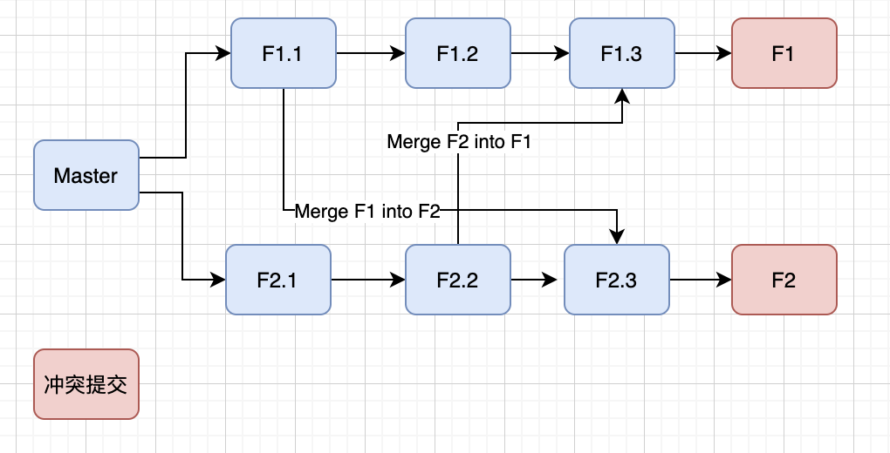

**使用Merge合并分支**
1. 寻找F1、F2公共祖先(F1.3、F2.2)
2. 对比F1和F1.3的差异 D1(F1)
3. 对比F2和F2.2的差异 D2(F2.3+F2)
4. 对比D1和D2，判断是否冲突
5. 保存解决的冲突，形成新的提交
6. 将F1指向最新提交

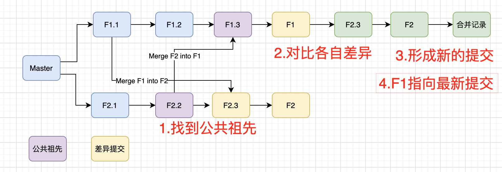

**使用Rebase合并分支**
* Rebase F2 onto F1
  1. 寻找F1、F2公共祖先(F1.3、F2.2)
  2. 对比F1和F1.3的差异 D1(F1)
  3. 对比F2和F2.2的差异 D2(F2.3+F2)
  4. 基于F1提交F2.3，形成F2.3*
  5. 基于F1提交F2，判断是否冲突
  6. 保存解决的冲突，并形成新的提交F2*
  7. F2指向最新提交F2*
* Merge F2 into F1
  1. 寻找F1、F2公共祖先(F1)
  2. 应用fast-forward策略，F1指向F2最新提交

1.
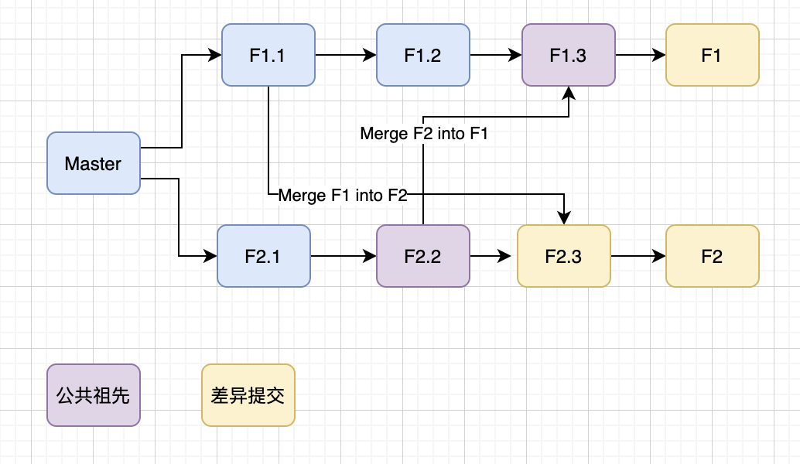
2.
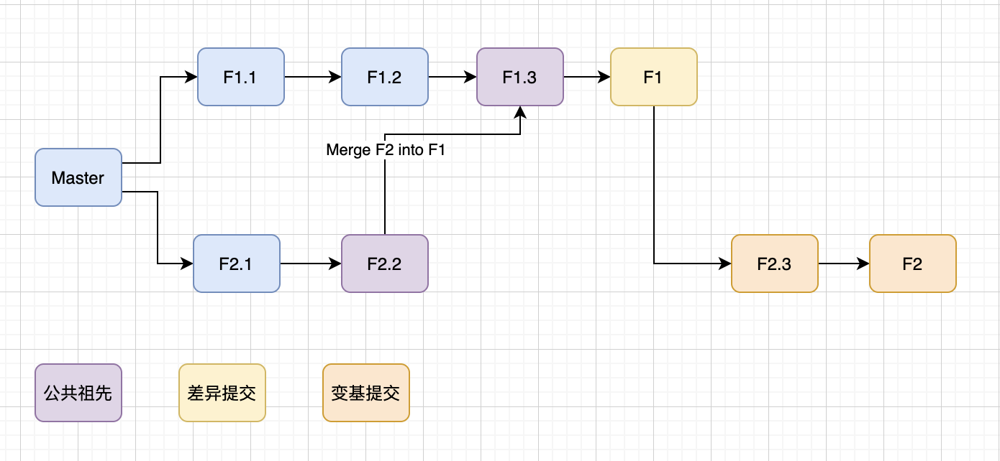
3.
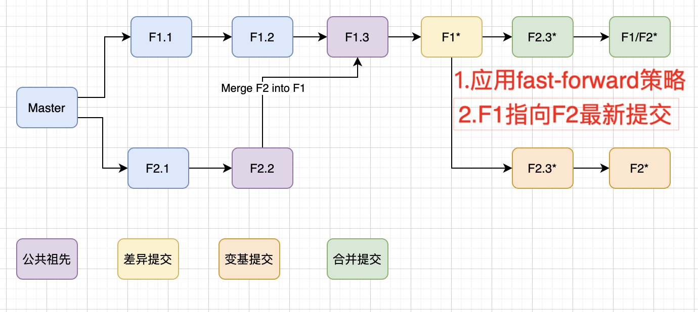

rebase在提交次数较多且差异较大的情况下，并不友好，可能出现多次解决冲突的问题。这种情况有两种解决方案:
1. 在被中断时，使用 ```git rebase --skip``` 继续，到最后一次提交的时候一起解决冲突
2. 直接使用```git merge```，一次性解决冲突，形成一次新的提交
上述情况在代码同步频率得当的情况下很少发生

## 如何在IDEA中使用Rebase策略

* 提交本地代码（如有）
  - 【右键】->【Git】->【Stash Changes】 将提交暂存
  - 【右键】->【Git】->【Commit】 形成完整提交
* 获取远程分支
  - 【右键】->【Git】->【Pull】->【Modify options】->【Rebasing incomming changes ...】指定获取某个远程分支
  - 【Preference/设置】->【Version Control】->【Git】->【Update】->【Update Method】->【Rebase】设置全局获取策略为rebase
* Rebase自身提交
  - 【右键】->【Git】->【Rebase】->【目标分支】 以父亲节点作为基准，Rebase当前分支提交到目标分支
  - 【Rebase】->【目标分支】->【Modify options】->【Specify a new base ...】->【指定提交base】 以指定提交作为基础，Rebase当前分支到目标分支
* 推送自身分支到远程仓库，并提交MR
  - 【右键】->【Git】->【Push】
  - 进入Gitlab Merge Request页面，选择自身分支和目标分支，形成MR

**提交本地代码**
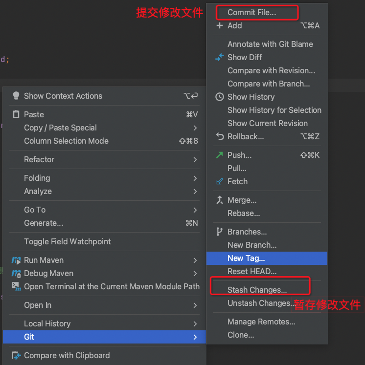

**获取远程分支**
1.
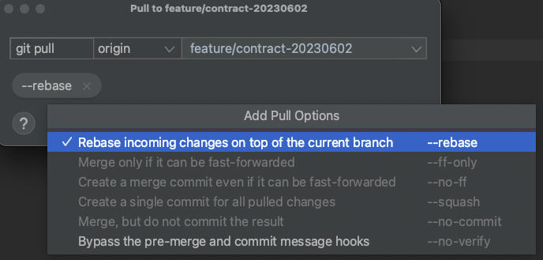
2.
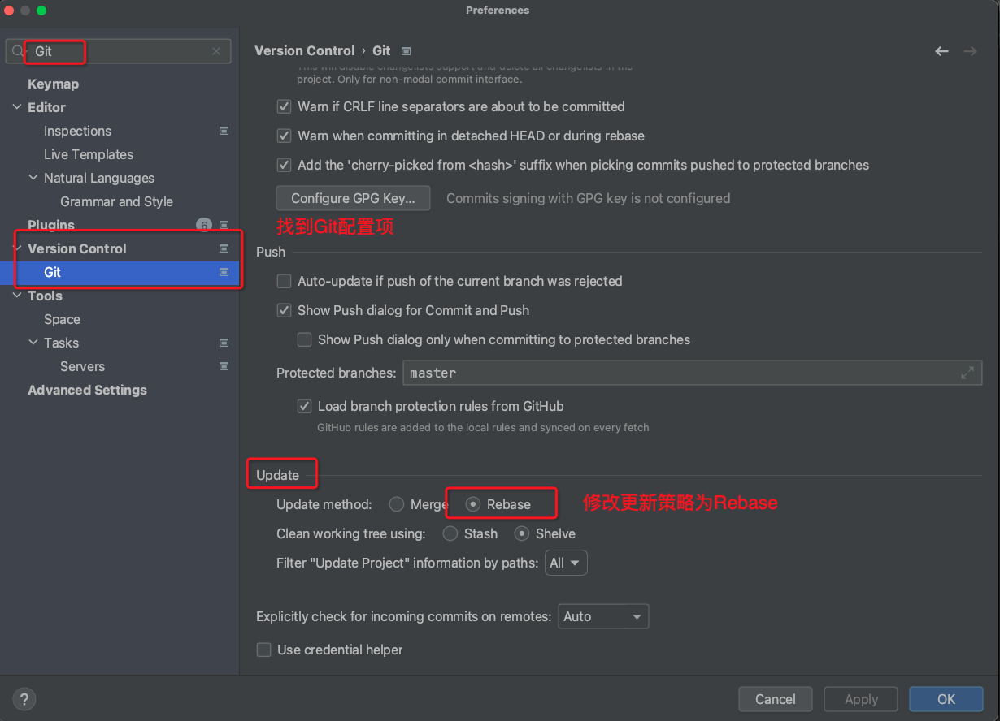

**Rebase自身提交**
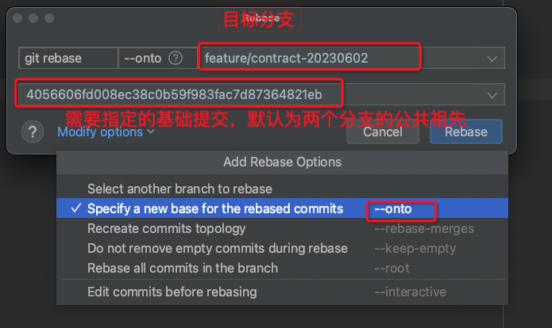

**推送自分支并提交MR**
1.
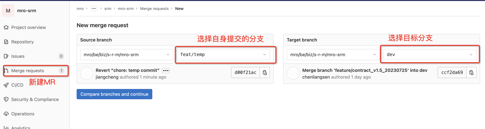
2.
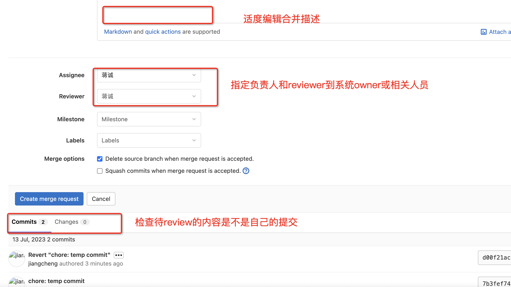

**Rebase --onto的妙用**

如果分支提交结构改变，或者存在一些我们想要舍弃的提交时，我们可以体会到 ```--onto``` 操作的好处

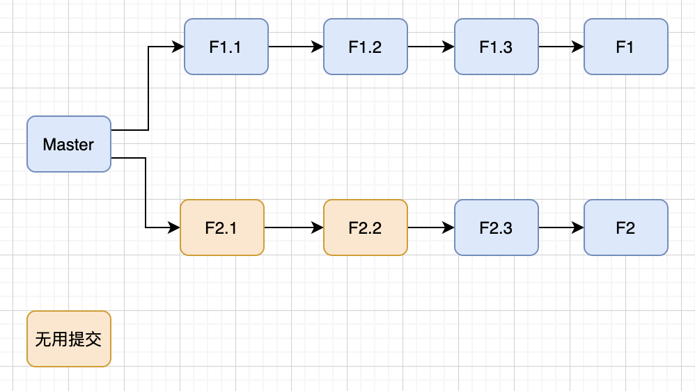

```
git checkout F2
git rebase --onto F1 F2.2
```

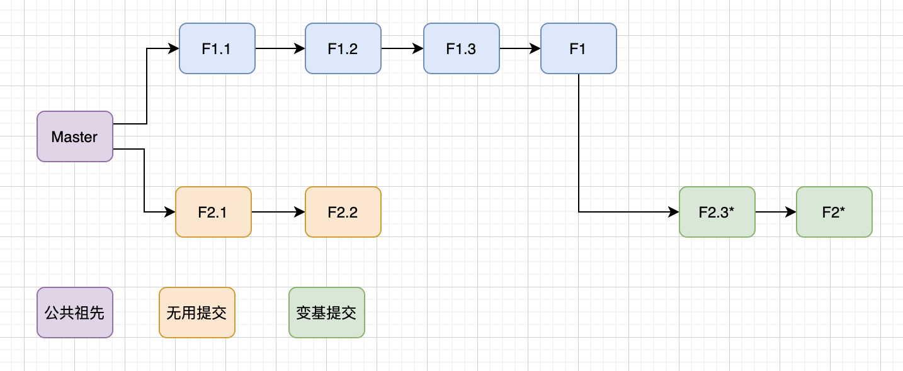

## 分支操作范例

假设有一次新的开发计划，分支命名为 ```feat/20230705``` ，开发者正确的操作步骤
* 获取远程分支
  - ```git fetch origin```
* 创建自身的开发分支
  - ```git checkout feat/20230705``` 切换到目标开发分支
  - ```git checkout -b feat/20230705-jc``` 创建自身开发分支
* 更新目标分支
  - ```git checkout feat/20230705```
  - ```git pull --rebase```
* 提交自身代码并Rebase
  - ```git checkout feat/20230705-jc```
  - ```git commit -am "feat: xxx" ```
  - ```git rebase feat/20230705```
  - ```git rebase --onto feat/20230705 {指定提交base}``` （可选）
  - ```git push -u origin feat/20230705-jc```
* 创建MR并提交CR
